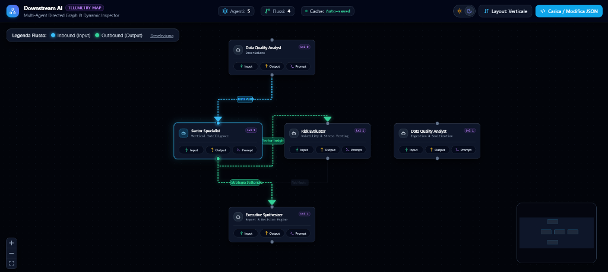

# 🤖 Downstream AI — Multi-Agent Telemetry Explorer

> **A dynamic, interactive, and auto-layout dashboard for multi-agent AI telemetry, execution tracing, and payload inspection.**



---

## 📌 Overview

**Downstream AI** is a state-of-the-art developer tool and architectural dashboard designed for AI engineers, software architects, and multi-agent researchers. It parses JSON telemetry configs and log streams from autonomous AI agent networks and automatically renders a clean, interactive directed graph.

Built with a **Local-First** philosophy (inspired by tools like *Excalidraw*), all computation, parsing, and caching happen directly inside the user's browser. Proprietary system prompts, sensitive customer payloads, and execution logs never leave your local machine.

---

## ✨ Key Features

- 🗺️ **Automatic Directed Graph Layout (Dagre):** Smart topological positioning without requiring manual $(X, Y)$ coordinates.
- 🎯 **Explicit Tier & Rank Control (`level`):** Align parallel agents on identical horizontal or vertical planes via the optional `"level"` attribute, backed by automated collision-prevention spacing.
- ⚡ **Dynamic Edge Animation & Highlight:** Clicking any agent node animates and highlights its **Inbound** flows in glowing cyan (`#38bdf8`) and its **Outbound** flows in vibrant emerald (`#34d399`), while non-connected channels are dimmed for maximum cognitive clarity.
- 🔍 **Embedded Monaco Code Inspector:** An accessible side drawer powered by the Visual Studio Code engine (Monaco Editor) in read-only mode, providing syntax highlighting and formatting for:
  - `Last Input` (JSON payload)
  - `Last Output` (JSON payload)
  - `System Prompt` (Markdown / Plaintext)
- 📝 **Live JSON Drawer & File Uploader:** Paste custom JSON directly, edit with either **Monaco** or **Native Text** mode, format with 1-click, or upload files via the native file browser or desktop **Drag & Drop**.
- 💾 **Automatic Local Cache (Local-First):** Edits and layout preferences are automatically synchronized with the browser's `localStorage` — your work is preserved across refreshes and browser restarts without requiring an external server or account.
- 🌓 **Dark / Light Theme & Layout Direction:** Seamless toggle between sleek Dark Mode and high-contrast Light Mode, plus instant switching between Vertical (Top-to-Bottom) and Horizontal (Left-to-Right) orientations.

---

## 💻 System Requirements

- **Node.js:** `>= 18.0.0` (LTS `v20.x` or `v22.x` recommended).
- **Package Manager:** `npm` (bundled with Node.js `>= 9.x`), `pnpm`, or `yarn`.
- **Browser:** Any modern evergreen browser with WebGL/Canvas support (Chrome, Edge, Firefox, Safari, Brave, Arc).
- **Operating System:** Windows, macOS, or Linux.

---

## 🚀 Quickstart & Installation

### 1. Clone the Repository
```bash
git clone https://github.com/your-username/downstream-ai.git
cd downstream-ai
```

### 2. Install Dependencies
```bash
npm install
```

### 3. Launch the Development Server
```bash
npm run dev
```
Open your browser and navigate to:
👉 `http://localhost:5173`

---

## 🛠️ Build & Production Commands

```bash
# Build optimized production bundle to /dist
npm run build

# Preview the local production build
npm run preview
```

---

## 📊 JSON Data Specification

Downstream AI parses standard telemetry configs structured as follows:

```json
{
  "agents": [
    {
      "id": "agent_1",
      "name": "Data Quality Analyst",
      "level": 0,
      "role": "Ingestion & Sanitization",
      "system_prompt": "You are an expert analyst validating and deduplicating financial feeds...",
      "last_input": {
        "raw_data": { "ticker": "NVDA", "revenue": "35.1B" },
        "source": "API"
      },
      "last_output": {
        "clean_data": { "symbol": "NVDA", "normalized_revenue": 35100000000 },
        "status": "success"
      }
    },
    {
      "id": "agent_2",
      "name": "Sector Specialist",
      "level": 1,
      "role": "Vertical Intelligence",
      "system_prompt": "Analyze clean data for semiconductor market share and peers...",
      "last_input": { "clean_data": { "symbol": "NVDA" }, "sector": "Tech" },
      "last_output": { "insights": "Strong expansion driven by Blackwell clusters..." }
    },
    {
      "id": "agent_3",
      "name": "Risk Evaluator",
      "level": 1,
      "role": "Volatility & Stress Testing",
      "system_prompt": "Evaluate macroeconomic volatility and customer concentration...",
      "last_input": { "insights": "..." },
      "last_output": { "risk_rating": "Moderate-High" }
    },
    {
      "id": "agent_4",
      "name": "Executive Synthesizer",
      "level": 2,
      "role": "Report & Decision Engine",
      "system_prompt": "Synthesize data quality, sector intelligence, and risk evaluation into executive brief...",
      "last_input": { "sector_insights": "...", "risk_profile": "..." },
      "last_output": { "action_required": "APPROVE_ALLOCATION_TIER_1" }
    }
  ],
  "flows": [
    {
      "source": "agent_1",
      "target": "agent_2",
      "label": "Clean Data"
    },
    {
      "source": "agent_2",
      "target": "agent_3",
      "label": "Sector Insights"
    },
    {
      "source": "agent_2",
      "target": "agent_4",
      "label": "Strategy Matrix"
    },
    {
      "source": "agent_3",
      "target": "agent_4",
      "label": "Risk Matrix"
    }
  ]
}
```

> **Note on `"level"`:**
> If omitted or empty (`null`, `""`), node hierarchy is automatically determined by Dagre's topological dependencies. When specified as an integer (e.g. `0`, `1`, `2`), nodes sharing the same level are locked side-by-side on the same tier with automatic anti-overlap spacing.

---

## 🏗️ Architecture & Technology Stack

- **Core Framework:** [React 18](https://react.dev/) + [Vite](https://vitejs.dev/)
- **Node Graph & Flow Canvas:** [@xyflow/react](https://reactflow.dev/) *(formerly React Flow)*
- **Graph Auto-Layout:** [dagre](https://github.com/dagrejs/dagre)
- **Code Editor:** [@monaco-editor/react](https://github.com/suren-atoyan/monaco-react) *(VS Code editor engine)*
- **Styling & Design System:** [Tailwind CSS](https://tailwindcss.com/) + [shadcn/ui](https://ui.shadcn.com/) design tokens
- **Icons:** [Lucide React](https://lucide.dev/)

---

## 🔒 Privacy & Local-First Philosophy

Downstream AI operates 100% client-side. No telemetry payloads, system prompts, or proprietary data are ever transmitted to third-party cloud servers or tracking endpoints. Everything is parsed and persisted strictly in your browser's local sandbox.

---

## 📄 License

Distributed under the **MIT License**. See `LICENSE` for details.
